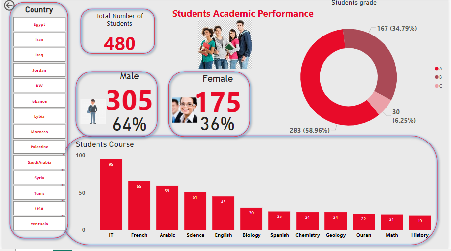

# Students' Academic Performance

## Introduction
This is a power BI project on **student academic performance**. 🤓
The project is to analyze and derive insight to answer crucial questions and help students make data driven decisions

**_Disclaimer_**: _All datasets and report do not represent any institution but just a dummy dataset to demonstrate the capabilities of Power BI_

## Problem Statement
 1. Which gender performs best 
  2. Which course has the highest number of students
  
  ## Skills/concepts demonstrated
  
  The following Power BI were incorporated:
  
  
  ---
  -DAX 
  
  -Quick measures
  
  -Page navigation
  
  -Modelling
  
  -Filters
  
  ## Modelling
  No modelling because is a single table
  
  
  ## Visualization:
  The report comprises of 
  
  1.Country
  
  2. Gender
  
  3. Students' course
  
  You can interact with the report [here](https://app.powerbi.com/groups/me/reports/79a529be-8a64-4bde-872e-59abff83b463/ReportSection)
  
  ## Analysis
  
  The total no. of students is 480(four hundred and eighty)
  
  305 students are male making 64% |  175 students are female comprising 36%
  :-------------------------------:|:---------------------------------:
                      |         
  
  we have students from 14 countries
  
  
  ## Conclusions and Recommendation:
  From the analysis 
  
  -Male Peformed better than the female
  
  -The students actively performed brilliantly in both semester
  
  -IT has the largest number of students.
  
  ## Recommendation
  For a deep dive into the analytics, the datasets of the previous year will be required for comparison and data driven making 😄
  
  
  
  
  By AFOLABI ISRAEL OLAJIDE 
